<div align="center">


# KNetraHub (Khmer Netra Hub)

**A portal for everything in your infrastructure, one hub at a time.**

Self-hosted infrastructure operations: Docker Swarm orchestration, network & server monitoring,
and IP address management — behind one login, one theme, and one audit trail.

[](./LICENSE)
[](https://nuxt.com)
[](https://vuejs.org)
[](https://tailwindcss.com)
[](https://www.timescale.com)
[](https://docs.docker.com/engine/swarm/)

[Documentation](https://sengphirum.github.io/KNetraHub/documentation) · [Product Tour](#-product-tour) · [Quick Start](#-quick-start-development) · [Configuration](#️-configuration)

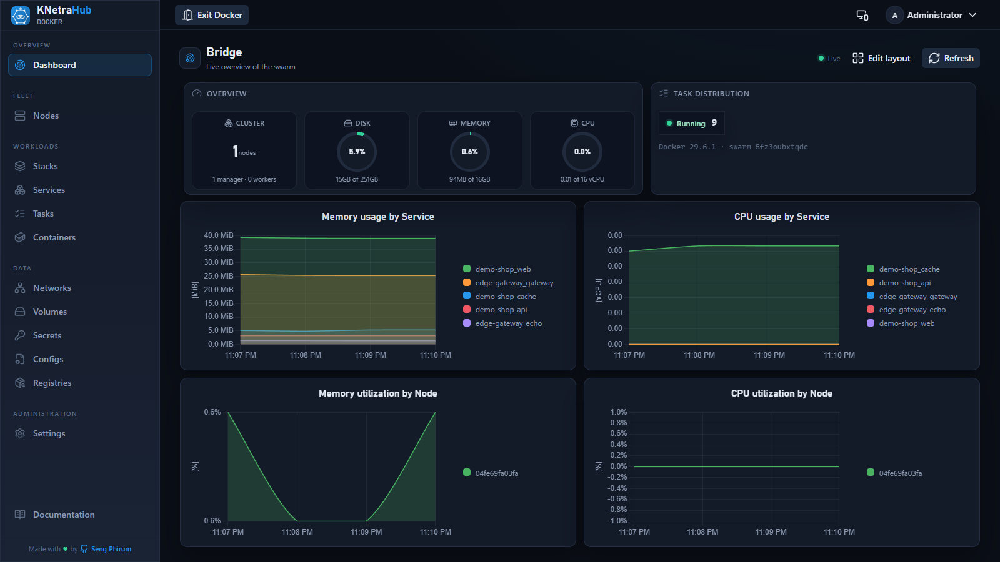

</div>

KNetraHub (formerly **DockHub**) is the portal shell—handling login, dashboard, sidebar, permissions, and settings—for a growing set of independent operations subsystems. These subsystems are loaded into the shell via **Module Federation**.

The first and only fully-built subsystem today is **KNetraHub-Docker**: a complete Docker Swarm management console featuring:
- Live nodes, services, stacks, tasks, networks, volumes, secrets, and configs
- GitOps stack versioning
- Alerting and Role-Based Access Control (RBAC)
- Audit logs

Built with **Nuxt 4** + **Nuxt UI 4** + **Tailwind v4**.

---

## 📑 Table of Contents

- [✨ Highlights](#-highlights)
- [📸 Product Tour](#-product-tour)
- [🏗️ Architecture](#️-architecture)
  - [Per-app Access](#per-app-access-keycloak-realm-roles)
  - [Module Federation](#why-module-federation-not-iframes)
  - [Host vs. Remote Side](#how-it-works-host-side)
  - [Database Separation](#database-separation)
- [🚀 Quick Start (Development)](#-quick-start-development)
  - [Local Swarm Development](#local-swarm-development)
- [🚢 Production Build & Deploy](#-production-build--deploy)
- [🧪 Smart QA & Screenshot Refresh](#-smart-qa--screenshot-refresh)
- [⚙️ Configuration](#️-configuration)
  - [Appearance](#appearance)
  - [LDAP & OIDC](#ldap--oidc-sso)
  - [GitLab Versioning](#gitlab-stack-versioning)
  - [Alerts](#alerts)
- [🔐 Roles & Tiers](#-roles--tiers)
- [🧩 How "Stacks" Work](#-how-stacks-work)
- [📡 Monitoring (Network + Server)](#-monitoring-network--server)
- [🗺️ Roadmap & Limitations](#️-roadmap--limitations)
- [🛠️ Tech Stack](#️-tech-stack)
- [📝 License & Author](#-license--author)

---

## ✨ Highlights

- **Live Swarm Control:** Manage nodes (drain/pause/activate, promote/demote, labels, remove), services (scale, redeploy, rolling image updates, logs, delete), tasks, and raw containers.
- **Git-Versioned Stacks:** Deploy stacks from compose YAML. Every deploy is committed to GitLab first, giving you a full change history and one-click **rollback** to any previous commit. Configurable entirely from the UI (no env vars required).
- **Alerting:** Notify Telegram, Microsoft Teams, or any generic webhook. Alerts trigger when a deploy fails, a service nears its CPU/memory limit, a node stops reporting, replicas stay degraded, or disk usage crosses a threshold. Customizable `{{placeholder}}` messages.
- **Data Resources:** Create and manage overlay networks, volumes, secrets (write-only), and configs.
- **Portal + App Launcher:** The home page lists only the apps you can reach (Dock, Net, Server, IP Mgt, etc.). The sidebar is contextual to the app you're in. Docker management is the built-in **"Dock"** app.
- **Per-App Access via Keycloak:** Each app is gated independently by realm roles, mapped in Settings → Apps & Access. Supported by a viewer/operator/admin tier per app.
- **Auth & RBAC:** Local accounts, LDAP, and OIDC SSO. Includes a global role (`viewer`/`operator`/`admin`) for portal administration.
- **Encrypted Credentials:** LDAP bind password, OIDC client secret, registry auth, GitLab token, and alert channel configs are all encrypted at rest (AES-256-GCM, derived from `NUXT_JWT_SECRET`).
- **Audit Log:** Every state-changing action is recorded with actor, target, and detail.

---

## 📸 Product Tour

Captured from a live instance (dark theme). The in-app documentation ships the same tour, plus a smart
search palette (<kbd>Ctrl</kbd> <kbd>K</kbd>) over every guide, env var, API endpoint, and Q&A entry.

| | |
| :---: | :---: |
| **Sign-in** — local accounts, LDAP / AD, OIDC SSO | **App launcher** — users see only the apps they may reach |
| 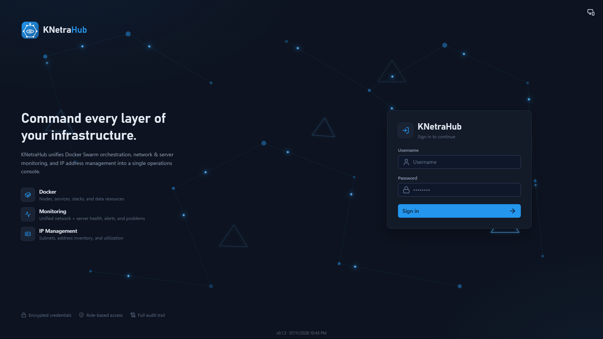 | 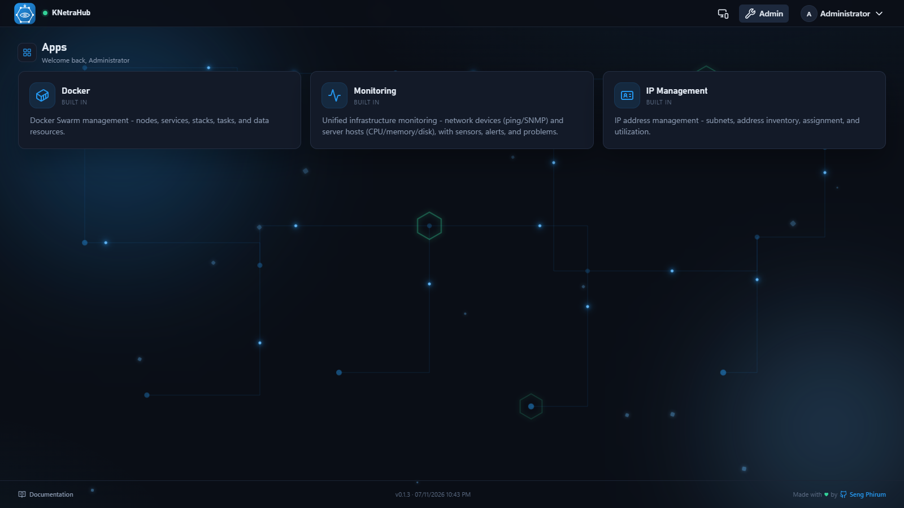 |
| **Stacks** — versioned deploys with tracked history | **Services** — scale, redeploy, rolling image updates |
| 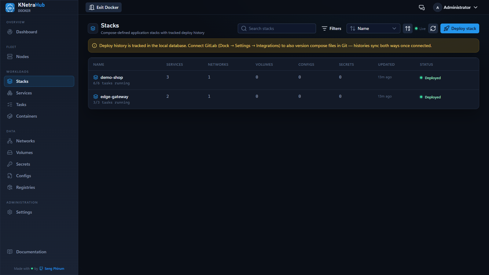 | 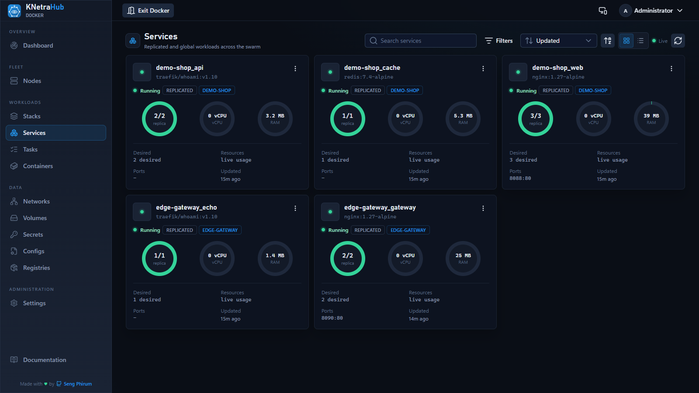 |
| **Service detail** — replicas, tasks, logs & usage history | **Nodes** — fleet availability and resources |
| 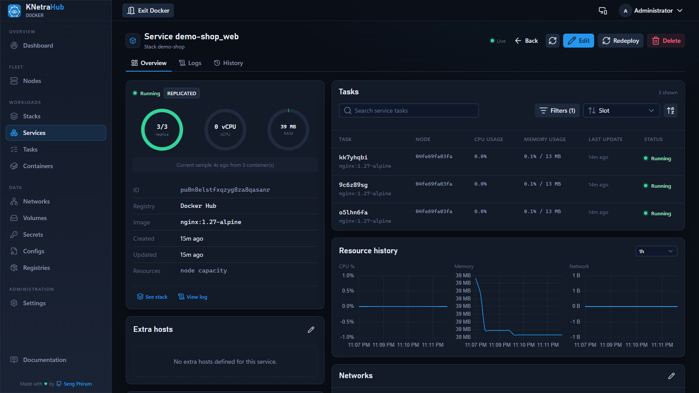 | 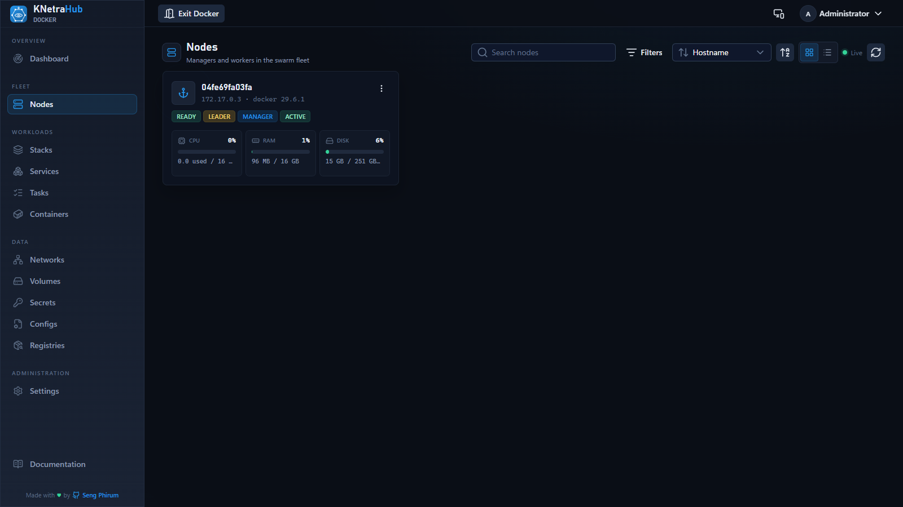 |
| **Monitoring** — unified network and server health | **IP Management** — subnets, addresses, VLANs, VRFs, devices, racks, circuits, requests, and vault ([details](layers/ipmgt/README.md)) |
| 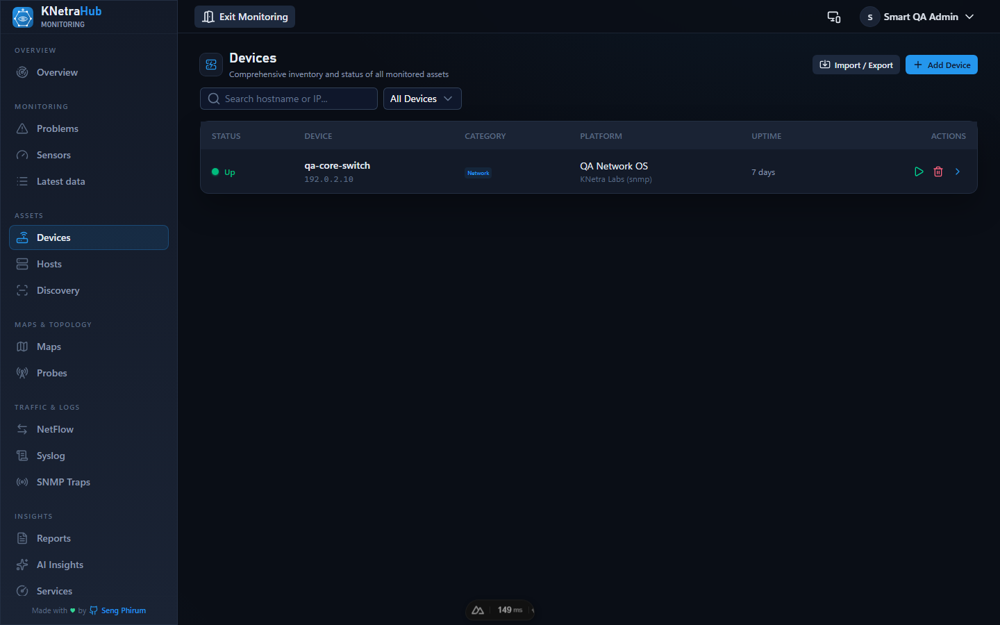 | 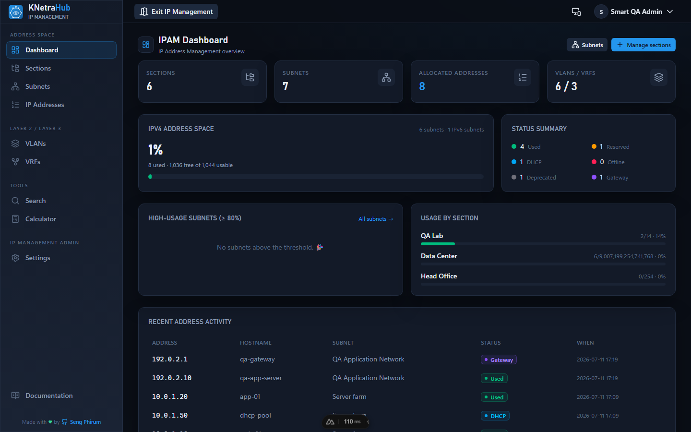 |
| **Documentation** — animated overview, guides, config & API reference | **Smart Q&A** — curated answers, deep-linked to the right guide |
| 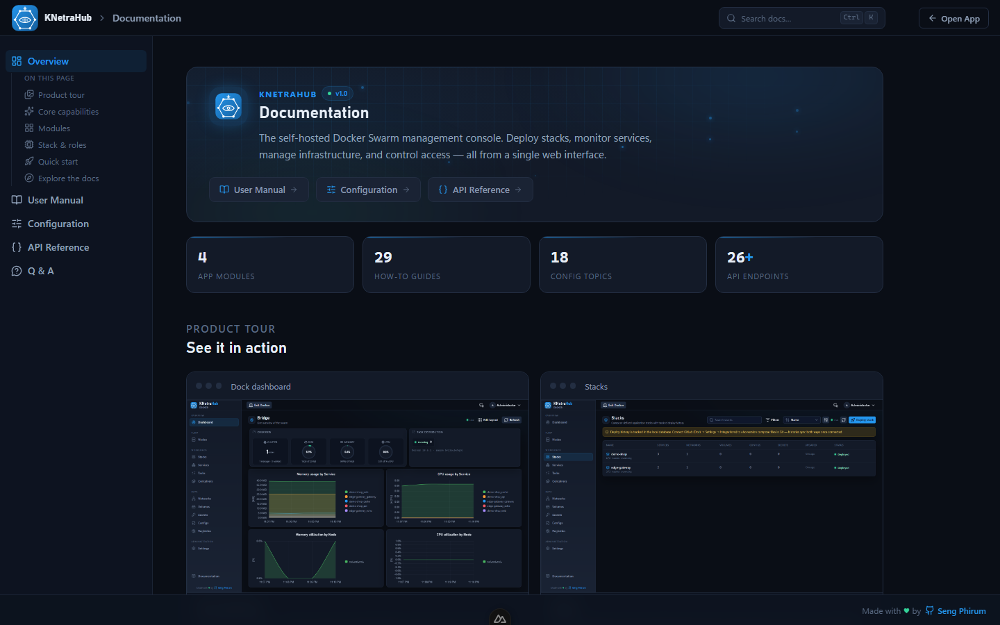 | 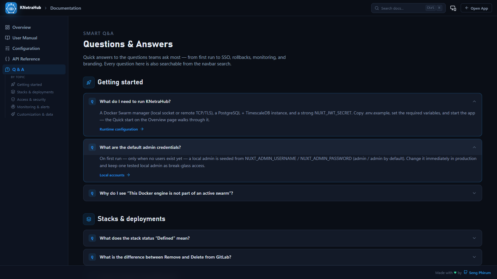 |

**Smart search** — press <kbd>Ctrl</kbd> <kbd>K</kbd> anywhere in the docs, ask a question, and jump straight to the answer:

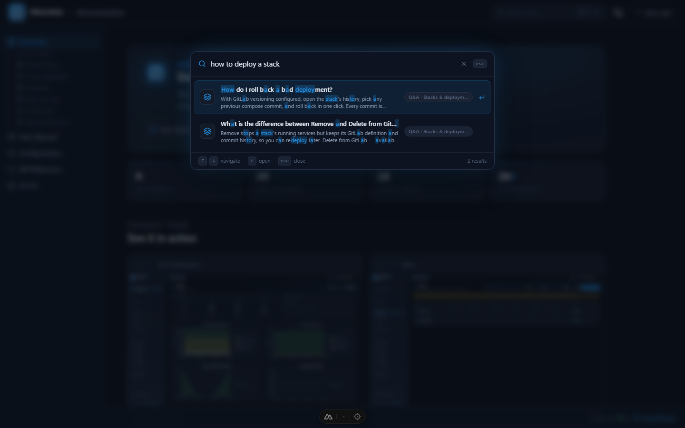

---

## 🧪 Smart QA & Screenshot Refresh

Run the read-only core QA workflow against any running KNetraHub instance. It checks the
database health probe, setup/auth APIs, public documentation, browser console, and—when
credentials are supplied—the authenticated launcher and Docker resource pages. Successful
captures replace the canonical files in `public/screenshots/`, so this README and the in-app
Product tour update together.

```bash
# Public core checks and documentation screenshots
./service.sh qa --base-url http://localhost:3000

# Include authenticated core pages (prefer env vars for secrets)
QA_USERNAME=admin QA_PASSWORD='secret' ./service.sh qa --scope core

# Initialize small fixtures and a temporary qa-admin, test every module, then clean up
./service.sh qa --init-data --scope full

# First run, or after clearing Playwright's browser cache
./service.sh qa --install-browser
```

Useful parameters include `--scope smoke|core|full`, `--browser chromium|firefox|webkit`,
`--screenshots-dir`, `--report-dir`, `--headed`, and `--no-screenshots`. The machine-readable
result is written to `.qa-results/smart-qa-report.json`. QA never performs mutations such as
deploy, scale, delete, or configuration updates.

`--init-data` is the explicit exception to the read-only rule: it transactionally creates only
deterministic `qa-*` fixtures covering portal audit data, Docker stack history, Monitoring
(network and server), and IP Management. Fixtures are removed after QA by default. Add
`--keep-data` for manual inspection, then remove them with `./service.sh qa --clean-data`.
The temporary account is `qa-admin` with local-only password `qa-local-only`; override that
password with `QA_FIXTURE_PASSWORD` when needed.

---

## 🏗️ Architecture

KNetraHub is split into a **portal core** (this repo's root `app/` and `server/`) and **module layers** under `layers/`, all served in-process by one Nuxt app:

```text
app/, server/, shared/           <- portal core: login/auth, launcher (home), admin settings,
                                    preferences, users, audit, alert channels, shared UI/utils
layers/
├── docker/                      <- Docker Swarm management (nodes, services, stacks, tasks,
│                                   containers, networks, volumes, secrets, configs, registries)
├── monitoring/                  <- network devices (/monitoring/network, /api/net) and
│                                   server hosts (/monitoring/server, /api/server) + pollers
└── ipmgt/                       <- IP address management (/ipmgt, /api/ipmgt) - see layers/ipmgt/README.md
```

Each layer is a [Nuxt layer](https://nuxt.com/docs/getting-started/layers) auto-registered from the `layers/` directory, mirroring the root structure (`app/pages`, `app/components`, `app/composables`, `app/utils`, `server/api`, `server/utils`, `server/plugins`). Everything merges into one build with unchanged URLs and component names — a module's code just lives in one folder now.

The **home page is an app launcher**: it shows only the apps the signed-in user may reach. The sidebar is **contextual** - it surfaces an app's own navigation only while you're inside that app. 

### Per-app Access (Keycloak realm roles)

Each app is gated independently by **Keycloak realm roles**, with a **viewer/operator/admin tier per app**. The app→role mapping is configured in **Settings → Apps & Access** (editable without redeploy).

> [!IMPORTANT]
> **Behavior change:** Keycloak users see **no apps until an admin fills in the role map** (or signs in as the local admin). LDAP users carry no realm roles yet, so they also get no apps unless promoted to local admin.

- **Local Admin:** A break-glass superuser that sees every app at admin tier regardless of the map.
- **Server-Side Enforcement:** `server/middleware/appAccess.ts` gates every API route, resolving the caller's tier and enforcing the *per-app* tier with no handler changes.

### Why Module Federation, not iframes?

An iframe isolates a remote's CSS/DOM cleanly, but it can't share the portal's layout, theme, or navigation. Module Federation loads a remote's actual Vue component into the portal's own page—same sidebar, same header, same Nuxt UI/Tailwind theme—while keeping the remote's code independent.

### How it works (Host Side)

1. `app/utils/moduleRegistry.ts` lists every module.
2. `app/composables/useNav.ts` builds a sidebar group filtered by permissions.
3. Visiting a remote's route renders `<RemoteModuleLoader>` inside `<ClientOnly>`. It fetches a short-lived token, registers the remote, and shows the mounted component.
4. `app/plugins/module-federation.client.ts` initializes the runtime and contributes the portal's own Vue instance to the federation share scope.

### How it works (Remote Side) - KNetraHub-Net

`remotes/knetrahub-net/` is a separate, independently runnable Nuxt 4 project:
- `ssr: false` (CSR-only to sidestep SSR/Module Federation conflicts).
- Uses `@module-federation/vite` to expose components.
- Fixes applied for `remoteEntry.js` routing, CORS handling, and strict ES module types.

### Database Separation

One shared Postgres/TimescaleDB instance, separated by **schema**:
- Portal tables in `public`.
- `KNetraHub-Net` owns a `net` schema.
- Future modules like `KNetraHub-Server` will follow the identical pattern (`server` schema).

### Shared Authentication

The portal handles login and holds the session in an `httpOnly` cookie. The `RemoteModuleLoader` fetches a 5-minute, audience-scoped JWT and passes it to the remote API. The remote API verifies it independently—never trusting the portal or frontend.

---

## 🚀 Quick Start (Development)

```bash
pnpm install
cp .env.example .env          # edit as needed
pnpm run dev                   # http://localhost:3000
```

By default, it talks to Docker at `/var/run/docker.sock`, so run it **on a swarm manager node**. On first run, it seeds an admin account:
- **Username:** `admin`
- **Password:** `admin`

> [!WARNING]
> Override the seed with `NUXT_ADMIN_USERNAME` / `NUXT_ADMIN_PASSWORD` and **change it immediately** in production.

### Running with a Remote Subsystem (Module Federation)

To see KNetraHub-Net loaded into the portal:
```bash
pnpm run dev:mf
```
This runs the portal (`:3000`), the KNetraHub-Net UI (`:3101`), and its API (`:4101`) side by side. Visit `http://localhost:3000/net`.

### Local Swarm Development

To run against a local disposable swarm instead of your host Docker engine:
```bash
pnpm run dev:swarm
```
This uses [`docker/docker-compose.dev.yml`](./docker/docker-compose.dev.yml) to start a lightweight Docker-in-Docker setup.

Useful commands:
```bash
pnpm run dev:swarm -- ps
pnpm run dev:swarm -- logs -f swarm-manager
pnpm run dev:swarm:down
pnpm run dev:swarm:reset  # removes the disposable swarm volumes
```

Equivalently, from a bash shell: `./service.sh dev`, `./service.sh dev --full` (second worker),
`./service.sh dev --down`, `./service.sh dev --reset`, or `./service.sh dev -- <docker compose args>`.

---

## 🚢 Production Build & Deploy

### Building Manually
```bash
pnpm run build
node .output/server/index.mjs
```

### Deploying to Swarm
Ship it as a swarm service, pinned to a manager node. Build and publish a versioned image:
```bash
./service.sh release
```

Deploy the published image:
```bash
docker stack deploy -c docker/docker-compose.yml knetrahub
```

Or, to build locally and deploy in one step (skips version bump + registry push):
```bash
./service.sh deploy
```

---

## ⚙️ Configuration

Everything is configured via environment variables (see [`.env.example`](./.env.example)).

| Variable | Purpose |
| --- | --- |
| `NUXT_JWT_SECRET` | Signs session cookies and encrypts stored credentials. **Set a long random value!** |
| `NUXT_DOCKER_SOCKET_PATH` | Docker socket path (default `/var/run/docker.sock`). |
| `NUXT_DOCKER_HOST` / `PORT` | Use remote engine over TCP. |
| `NUXT_DB_HOST` / `NAME` / `USER` | Postgres + TimescaleDB connection. |
| `NUXT_METRICS_RETENTION_DAYS` | How many days of metrics history to keep (default `30`). |

### Appearance
Change the app name, primary color, logos, and favicon directly from **Settings -> Appearance**. Changes preview live and are stored inline.

### LDAP & OIDC SSO
- **LDAP:** Set `NUXT_LDAP_ENABLED=true` and provide directory details. Map groups using `NUXT_LDAP_ADMIN_GROUP` and `NUXT_LDAP_OPERATOR_GROUP`.
- **OIDC:** Set `NUXT_OIDC_ENABLED=true`, `NUXT_OIDC_ISSUER`, `CLIENT_ID`, and `CLIENT_SECRET`. Compatible with Keycloak, Authentik, Okta, etc.

### GitLab Stack Versioning
Configure entirely via the UI: **Dock -> Settings -> Integrations**.
Deploying a stack commits the compose file to your repository. The status dot is only green when the token works. Removing running services leaves the compose file intact until explicitly deleted.

### Alerts
Configure via **Dock -> Settings -> Alerts**. Supports Telegram, MS Teams, and Webhooks. Alerts cover deploy failures, service usage thresholds, node downtime, degraded replicas, and high disk usage. 
`NUXT_ALERTS_INTERVAL_MINUTES=3` determines how often thresholds are checked.

---

## 🔐 Roles & Tiers

| Capability (within an app) | viewer | operator | admin |
| --- | :---: | :---: | :---: |
| View everything | ✅ | ✅ | ✅ |
| Scale / redeploy / deploy stacks | ❌ | ✅ | ✅ |
| Manage nodes, networks, volumes, secrets, configs | ❌ | ✅ | ✅ |
| Manage registries | ❌ | ❌ | ✅ |

- **Global Role:** Governs portal-level administration (users, audit, auth settings).
- **Per-App Tier:** Governs what you can do *inside* an app, derived via Settings → Apps & Access.

---

## 🧩 How "Stacks" Work

Docker Swarm has no native stack API. KNetraHub parses your compose YAML, ensures declared overlay networks exist, and creates/updates services with the `com.docker.stack.namespace` label. It warns rather than failing on unsupported compose directives.

---

## 📡 Monitoring (Network + Server)

The **Monitoring app** (`/monitoring`, layer `layers/monitoring/`) unifies real network-device
monitoring (PRTG-style) and server/host monitoring (Zabbix-style) behind one nav and one
`monitoring.view` / `monitoring.manage` permission pair. There is no simulated/dummy data:
every status, latency, interface, and alert comes from an actual device or host. Network
devices are polled by `server/plugins/netPoller.ts`; hosts by `server/plugins/serverPoller.ts`.
Both use real **ICMP ping** and **SNMP v1/v2c/v3**.

### How it works

- **Poller:** every `NUXT_NET_POLL_INTERVAL_SECONDS` it ICMP-pings each device (status +
  latency) and, for SNMP devices that respond, reads system info (sysName, sysDescr,
  sysObjectID, uptime) and the interface table (admin/oper status, speed, MAC, MTU, and
  **bit-rate computed from counter deltas**). SNMPv3 (noAuthNoPriv / authNoPriv / authPriv;
  MD5/SHA/SHA-256/SHA-512 auth; DES/AES/AES-256 priv) is fully supported per-device.
- **ICMP-latency sensor:** each device gets a live `ICMP Latency` sensor (ms).
- **Auto-alerts:** when a device stops responding a **critical** alert opens; when it
  recovers, the alert clears. Network alerts and Server problems both surface in one unified
  **Monitoring → Problems** view (`/monitoring/problems`) — acknowledge works for either source.
- **Discovery** (**Monitoring → Discovery**, `/monitoring/discovery`): a real ICMP/SNMP sweep
  of a CIDR (max **1024 hosts** per scan) that creates a device for every responder; the
  poller fills in interfaces on the next cycle.
- **Paused devices are skipped:** a device with monitoring paused is left alone by the
  poller — it shows as `paused` rather than flapping to `down`, and no "device down" alert
  fires while it's offline for maintenance.
- Flow (NetFlow) and Syslog collectors are not implemented; those pages stay empty until a
  collector is added.

### Prerequisites

1. **Reachability** from the server running KNetraHub to your devices: ICMP echo allowed
   (ping/status/latency) and UDP/161 open (SNMP polling + discovery identification).
2. **A working `ping` binary** — the Docker image installs `iputils` automatically; on bare
   metal ensure `ping` is on `PATH`.
3. **SNMP enabled on the devices**, with a community string you know (commonly `public`
   read-only) or v3 credentials. Each device stores its own version/community; otherwise the
   env defaults below apply.

### Configure (env)

All optional — sensible defaults shown. See [`.env.example`](./.env.example).

| Variable | Default | Purpose |
|---|---|---|
| `NUXT_NET_POLLING_ENABLED` | `true` | Master switch for the poller |
| `NUXT_NET_POLL_INTERVAL_SECONDS` | `60` | How often each device is polled |
| `NUXT_NET_POLL_CONCURRENCY` | `16` | Devices polled in parallel |
| `NUXT_NET_SNMP_COMMUNITY` | `public` | Default community (per-device value wins) |
| `NUXT_NET_SNMP_VERSION` | `v2c` | Default SNMP version (`v1`/`v2c`) |
| `NUXT_NET_SNMP_TIMEOUT_MS` | `2000` | Per-request SNMP timeout |
| `NUXT_NET_PING_TIMEOUT_SECONDS` | `2` | Per-host ICMP timeout |
| `NUXT_NET_DISCOVERY_CONCURRENCY` | `64` | Parallel hosts during a scan |

### Add & organize devices

- **Auto-discovery (recommended):** **Monitoring → Discovery**, needs the *operator* tier.
  Enter a subnet (e.g. `192.168.1.0/24`), pick **Ping + SNMP**, **Ping only**, or **SNMP
  only**, optionally set the SNMP community, and start the scan.
- **Add one device:** **Monitoring → Network → Devices → Add Device.** Optionally pick a
  **Template** to prefill category + SNMP settings, then enter hostname/IP and save — the
  next poll cycle populates status, latency, and ports.
- **Device templates** (**Monitoring → Settings → Templates** tab, needs *admin*): save a
  reusable bundle of monitoring defaults (category, poll method, SNMP v1/v2c/v3 credentials)
  under a name like *"Core Switch — SNMPv3"*.
- **Categories** (**Monitoring → Settings → Categories** tab): a single fixed list shared by
  the Add Device form and a device's Settings tab — `network`, `server`, `storage`, `iot`,
  `ping-only`.
- **Groups** (**Monitoring → Groups**, `/monitoring/groups`): logical groups by site/role/
  owner; deleting a group never deletes devices.
- **Pause/resume monitoring:** pause a device (detail page header or inventory row) before
  planned maintenance; **Resume** returns it to polling.

### Clean up old/dummy data

Existing databases keep whatever was seeded before. Remove devices per-device (trash icon on
**Monitoring → Network → Devices**, cascades to that device's interfaces/sensors/alerts), or
via a full SQL reset:

```sql
TRUNCATE net_flows, net_syslog, net_backups, net_device_groups, net_sensors,
         net_interfaces, net_alerts, net_devices RESTART IDENTITY CASCADE;
```

Fresh installs start empty automatically — no fake devices are seeded.

### Verify it's working

A device you can ping flips to **up** with a latency value within one poll interval;
blocking ICMP flips it to **down** and opens a critical alert on **Monitoring → Problems**
(restoring it clears the alert). For SNMP devices, the **Ports** tab on the device page lists
interfaces, with in/out bit-rates appearing from the **second** poll onward (the first poll
just seeds the counters).

### Troubleshooting

| Symptom | Likely cause |
|---|---|
| Everything shows **down** | ICMP blocked from the server, or `ping` binary missing |
| Status up but **no SNMP data** | Wrong community/version, UDP/161 blocked, or device is v3 with no credentials set |
| **No bit-rates** on interfaces | Only one poll has run — wait one more interval |
| Discovery finds **nothing** | Wrong CIDR, firewall, or community; try `Ping only` first |
| Scan rejected as **too large** | Range > 1024 hosts — scan a smaller subnet (e.g. `/24`) |

---

## 🗺️ Roadmap & Limitations

**Currently Implemented:**
- Live read + control for Docker resources.
- LDAP/OIDC auth with JWT/RBAC.
- GitLab commit history and rollback.
- Alerting and encrypted credential storage.
- Working Module Federation portal shell.

**To-Be Built:**
- Real KNetraHub-Server & KNetraHub-IPMgt modules.
- Real agent collectors for server/network/asset modes.
- Container exec/terminal.
- Webhook-driven GitOps redeploys.

**Limitations:**
- A federated component runs inside the portal's Vue instance. `useRuntimeConfig()` resolves to the portal's config. Use Vite's `define` for remote configurations.

---

## 🛠️ Tech Stack

- **Portal:** Nuxt 4 (Nitro + Vue 3), Nuxt UI 4, Tailwind v4, dockerode, ldapts, jose, Postgres + TimescaleDB.
- **Remote (KNetraHub-Net):** Nuxt 4 (CSR-only), `@module-federation/vite`.
- **API (KNetraHub-Net-API):** Standalone Nitro, `pg`, `jose`.

---

## 📝 License & Author

**Author:** Seng Phirum — [sengphirum143@gmail.com](mailto:sengphirum143@gmail.com)

MIT © 2026 Seng Phirum

See [LICENSE](./LICENSE) for full details.
